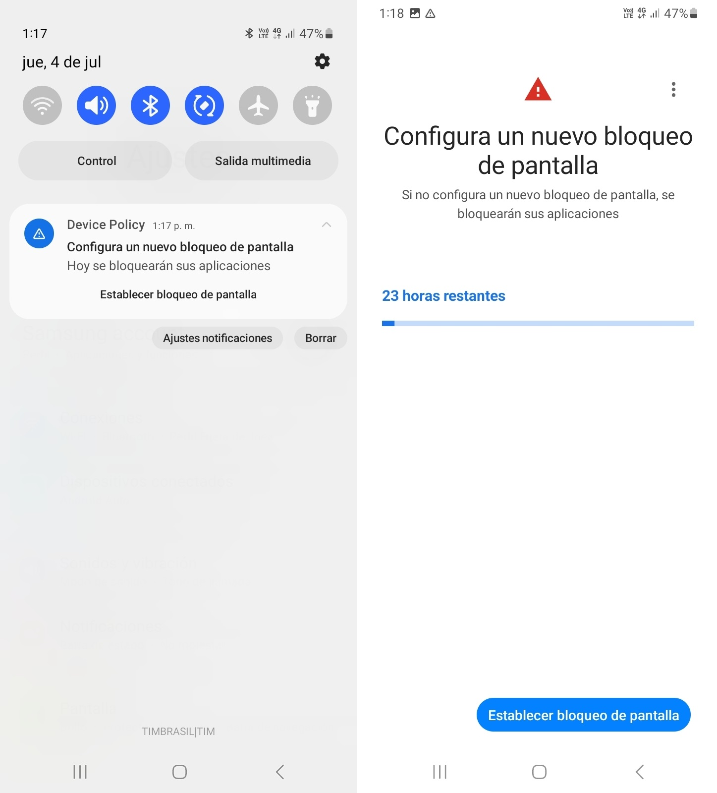

# Restricciones de Contraseña

Al estar en la pestaña "Ajustes" de la pantalla "Edición de políticas", haga clic en "Restricciones de contraseña" para ver las opciones de configuración de contraseña. En la siguiente tabla, se describen los ajustes de contraseña.

<table data-header-hidden><thead><tr><th width="215"></th><th></th></tr></thead><tbody><tr><td><strong>Configuración</strong></td><td><strong>Descripción</strong></td></tr><tr><td>Calidad mínima de la contraseña</td><td>
Cuando la calidad mínima de la contraseña es "Cualquiera" significa que se requiere una contraseña, pero no hay restricciones sobre lo que la contraseña debe contener.

Las otras posibilidades de configuración de contraseña son:
<ul><li>ninguna - no hay requisito de contraseña;</li><li>numérica - la contraseña debe contener <strong>al menos</strong> caracteres numéricos;</li><li>numérica compleja - la contraseña debe contener <strong>al menos</strong> caracteres numéricos sin secuencias repetidas (4444) u ordenadas (1234, 4321, 2468).</li><li>alfabética - la contraseña debe contener <strong>al menos</strong> caracteres alfabéticos (o símbolos).</li><li>alfanumérica - la contraseña debe contener <strong>al menos</strong> caracteres numéricos y alfabéticos (o símbolos).</li><li>compleja - la contraseña debe contener <strong>al menos</strong> una letra, un carácter numérico y un símbolo.</li><li>biometría - El dispositivo debe protegerse con una tecnología de reconocimiento biométrico de baja seguridad como mínimo.</li></ul>
<em>Para más información, acceda a la sección</em> <a href="restricciones-de-contrasena.md#exigencia-de-contrasena-y-cumplimiento-de-la-politica"><em>Exigencia de Contraseña y Cumplimiento de la Política</em></a> <em>más abajo en esta página.</em>
</td></tr><tr><td>Historial máximo de contraseñas que el usuario no podrá volver a utilizar</td><td>Define la cantidad máxima del historial de las últimas contraseñas utilizadas que el usuario no podrá volver a usar. Ingrese un número siendo el valor máximo 10.</td></tr><tr><td>Máximo de contraseñas incorrectas antes de ejecutar Wipe</td><td>Utilice esta configuración si desea establecer un número de intentos de contraseña incorrectos aceptados (máximo 10). Después del número de intentos establecido, el dispositivo ejecutará un borrado (wipe) y restablecerá los datos de fábrica.</td></tr><tr><td>Tiempo de espera de expiración de la contraseña (días)</td><td>Utilice esta configuración si desea establecer una cantidad de días para la expiración de la contraseña. Después de este período (días) la contraseña necesitará ser restablecida por el usuario.</td></tr><tr><td>Requerir desbloqueo de contraseña</td><td>
Con esta opción se define el periodo que transcurre después de desbloquear un dispositivo o perfil de trabajo con una forma de autenticación segura (contraseña, PIN, patrón) que además se puede desbloquear mediante cualquier otro método de autenticación (p.ej., huella dactilar, agentes de confianza o rostros). Una vez transcurrido el período especificado, solo se pueden usar formas seguras de autenticación para desbloquear el dispositivo o el perfil de trabajo.

Si se selecciona: “ Todos los días” el tiempo de espera se establece en 24hrs

Si se selecciona: “Patrón del dispositivo”, el tiempo de espera se establece en el valor predeterminado del dispositivo.
</td></tr><tr><td>Longitud mínima de la contraseña</td><td>Esta configuración establece el tamaño mínimo necesario para las contraseñas creadas, fortaleciendo la seguridad de los datos.</td></tr><tr><td>Número mínimo de letras requeridas en la contraseña</td><td>Esta configuración establece la cantidad mínima de letras necesarias para las contraseñas, con un número específico de caracteres alfabéticos en las combinaciones de contraseñas.</td></tr><tr><td>Número mínimo de letras minúsculas requeridas en la contraseña</td><td>Esta configuración determina el mínimo de letras minúsculas necesarias en contraseñas</td></tr><tr><td>Número mínimo de caracteres que no sean letras (dígitos numéricos o símbolos) necesarios en la contraseña</td><td>Establece el mínimo de caracteres no alfabéticos necesarios en las contraseñas</td></tr><tr><td>Número mínimo de dígitos numéricos necesarios en la contraseña</td><td>Estipula el número mínimo de dígitos numéricos necesarios en las contraseñas</td></tr><tr><td>Número mínimo de símbolos necesarios en la contraseña</td><td>Esta configuración establece la cantidad mínima de símbolos requeridos en las contraseñas, dentro de las combinaciones de contraseñas.</td></tr><tr><td>Número mínimo de letras mayúsculas requeridas en la contraseña</td><td>Establece la cantidad mínima de letras mayúsculas obligatorias en la contraseña.</td></tr></tbody></table>

#### Exigencia de Contraseña y Cumplimiento de la Política

Cuando se aplica una política de seguridad de contraseña a un dispositivo, este debe cumplir con dicha política. Si la contraseña actual del dispositivo no cumple con los requisitos definidos por la política, se llevará a cabo el siguiente proceso:&#x20;

* Si la contraseña del dispositivo no cumple con la política (por ejemplo, si es demasiado débil o no cumple con los criterios mínimos de seguridad establecidos), el dispositivo mostrará un mensaje de alerta.&#x20;
* Esta alerta sirve para notificar al usuario de que la contraseña necesita ser cambiada por una que cumpla con la política de seguridad.&#x20;
* El usuario tiene un plazo de 24 horas para realizar este cambio.

<figure><figcaption></figcaption></figure>

* Si después de 24 horas la contraseña aún no ha sido modificada para cumplir con las exigencias de la política, el dispositivo será bloqueado. En 48 horas, el dispositivo se volverá inaccesible hasta que se configure una contraseña compatible.&#x20;
* Esta medida es una exigencia de Google para garantizar que los dispositivos mantengan un nivel mínimo de seguridad. La contraseña del dispositivo debe ser, como mínimo, igual o más segura que la definida por la política.
