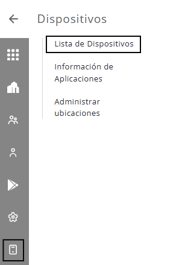

# Lista de Dispositivos

Para saber cómo administrar los dispositivos activos de la empresa, siga los pasos descritos a continuación.

Haga clic en el menú "Dispositivos" opción "Lista de dispositivos" para acceder a la pantalla.

<figure><figcaption></figcaption></figure>

Se mostrará la siguiente pantalla:

<figure><figcaption></figcaption></figure>

1. En la parte superior de la pantalla, el sistema muestra la distribución de los dispositivos, separados por fabricantes.
2. Utilice los filtros Grupo, Política, Modelo y Fabricante para buscar los dispositivos si desea listar.
3. Utilice los Filtros Avanzados para refinar su búsqueda con las siguientes opciones:
   * **Modo de Gestión:** Filtre dispositivos según el modo de gestión configurado.
   * **Fecha de Registro:** Seleccione un período específico utilizando la Fecha Inicial y la Fecha Final para localizar dispositivos registrados en ese intervalo.
   * **Localidad:** Elija una localidad por nombre o dirección.
   * **Distancia a la Localidad:** Calcule la distancia entre la última ubicación conocida del dispositivo y la dirección seleccionada.
4. Para localizar un dispositivo específico, ingrese el número de teléfono, nombre del usuario, IMEI, ICCID, departamento o teléfono del usuario del dispositivo en el campo "Buscar".
5. Para exportar el informe de los dispositivos, haga clic en el botón "Excel". El sistema mostrará en el informe sólo la información de las columnas visibles en la pantalla.
6. Para copiar la información de los dispositivos, haga clic en el botón "Copiar". El sistema copiará al portapapeles sólo la información de las columnas visibles en la pantalla.
7. Haga clic en la opción de "Acciones en lote" para aplicar una acción a varios dispositivos a la vez. Para más información, acceda al contenido Acciones en lote en esta página.
8. La lista de dispositivos se muestra en la parte inferior de la pantalla.&#x20;
9. Ordene las columnas: Usuario, Identificación, Licencia, IMEI, Modelo, Fecha de Registro y Fecha de la última comunicación, utilizando las flechas "↑↓" al lado de cada columna.
10. Use los tres puntos "..." para mostrar el menú de acciones y aplicar la acción deseada al dispositivo.
11. Haga clic en el ícono de filtro para seleccionar las columnas que serán visibles, use el campo de búsqueda para buscar las columnas por texto y realizar el filtro, luego haga clic en "Guardar" para definir la configuración como predeterminada para la pantalla del usuario que ha iniciado sesión. Si el usuario no realiza la personalización, se mostrarán las siguientes columnas como predeterminadas: Usuario, Identificación, Licencia, IMEI, Modelo y Política.

<figure><figcaption></figcaption></figure>

Las opciones de columnas disponibles son: Usuario, Identificación, Licencia, IMEI, Modelo, Número de Serie, Política, Modo de Gestión, Versión de la aplicación , ICCID, Fabricante, Fecha de Registro, Sistema Operativo, Grupo, Departamento, Teléfono del Usuario, Estado, Fecha de la última comunicación, Localidad, Distancia a la Localidad.

### Acciones por lotes

Ao hacer clic en la opción "Acciones por lotes", el sistema mostrará una pantalla que contiene algunos campos para completar, como se puede ver en la pantalla a continuación.

<figure><figcaption></figcaption></figure>

* Empresa: haga clic en el campo "Empresa" y luego en el nombre de la empresa para enviar un comando a todos los dispositivos de la empresa (al seleccionar la empresa, los campos de grupo y usuario se desactivarán).&#x20;
* Grupos: haga clic en "Grupo" y elija el grupo deseado.&#x20;
* Usuario de dispositivos: haga clic en "Usuario" y elija el usuario deseado.&#x20;
* Comandos: haga clic en "Comando" y elija el comando deseado. Los comandos disponibles son:  Desactivar dispositivo, Activar dispositivo, Apagar la pantalla, Reiniciar el dispositivo y Quitar dispositivo (limpiar)).

Después de definir los datos en la pantalla, haga clic en "Enviar" para enviar el comando. Antes de realizar el envío, el sistema abrirá un cuadro de diálogo con los botones "Confirmar" y "Cancelar".

### **Información del dispositivo**

La información del dispositivo que se muestra en la lista es:&#x20;

* Usuario - nombre del usuario registrado en el portal;&#x20;
* Identificación - Identificación registrada para el dispositivo;&#x20;
* Teléfono - número de teléfono;&#x20;
* IMEI - número interno y único en cada dispositivo. En Android 10 ya no es posible capturar esta información del dispositivo porque utilizamos otro método para recibir esta información con el Enriquecimiento de URL;&#x20;
* Modelo - modelo de dispositivo;&#x20;

Al hacer clic en el signo ">" junto al usuario, el sistema muestra más información.

* Política - nombre de la política asignada al dispositivo;&#x20;
* Modo de administración - modo de administración asignado al dispositivo;
* Versión de la aplicación - versión de la aplicación **Movistar Gestión de Dispositivos** instalado en el dispositivo;&#x20;
* ICCID - número de chip SIM;&#x20;
* Fabricante - nombre del fabricante del dispositivo;&#x20;
* Sistema operativo - versión de Android;&#x20;
* Fecha de registro - fecha y hora de registro del dispositivo;&#x20;
* Grupo - grupo al que está asociado el dispositivo;&#x20;
* Departamento - Es un campo de texto libre, es decir, el administrador puede escribir lo que desee. Indica la unidad o departamento de la organización al que está asignado el dispositivo.
* Teléfono del Usuario - Es un campo de texto libre, es decir, el administrador puede escribir lo que desee. Indica el número de teléfono asociado al usuario del dispositivo.
* Fecha de la última comunicación - última comunicación del dispositivo;&#x20;
* Estado - indica el estado del dispositivo. Los estados que puede tener un dispositivo están en la tabla siguiente:

<table data-header-hidden><thead><tr><th width="229"></th><th></th></tr></thead><tbody><tr><td><strong>Estado</strong></td><td><strong>Descripción</strong></td></tr><tr><td>Activo</td><td>El dispositivo está activo.</td></tr><tr><td>Desactivado</td><td>El dispositivo está desactivado.</td></tr><tr><td>Eliminado</td><td>El dispositivo ha sido eliminado. Este estado se usa en el reporte de estado final cuando el dispositivo confirma la eliminación.</td></tr><tr><td>Aprovisionando</td><td>Se está aprovisionando el dispositivo. Los dispositivos recién registrados permanecen en ese estado hasta que se aplica una directiva.</td></tr></tbody></table>
